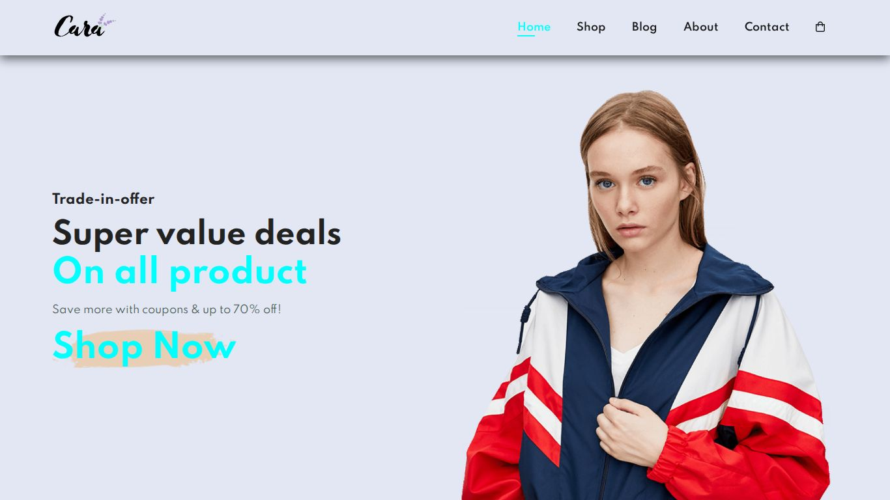
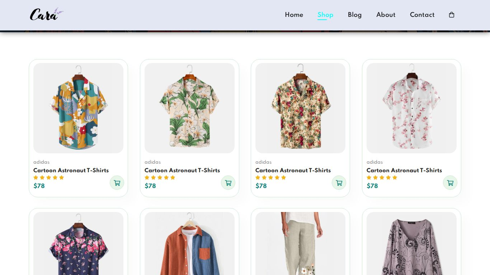
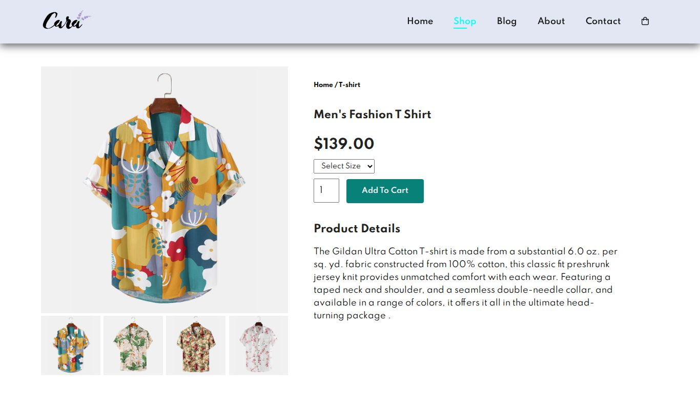
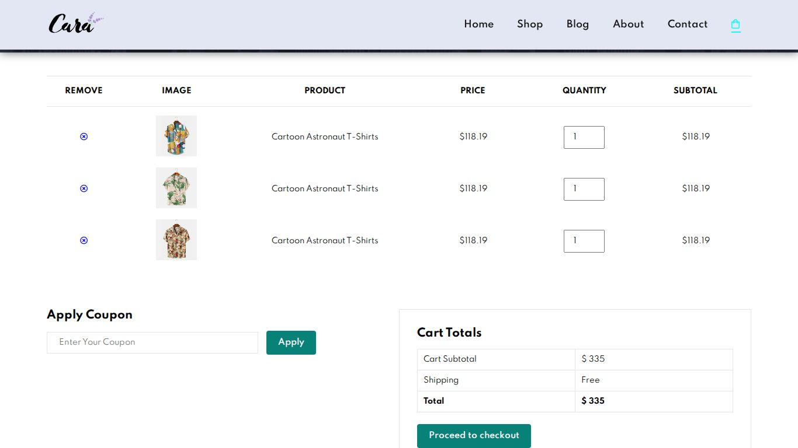
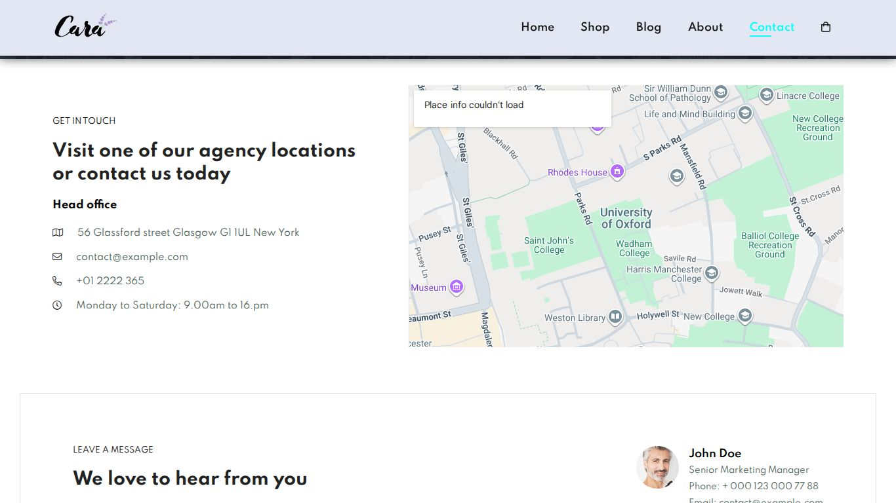
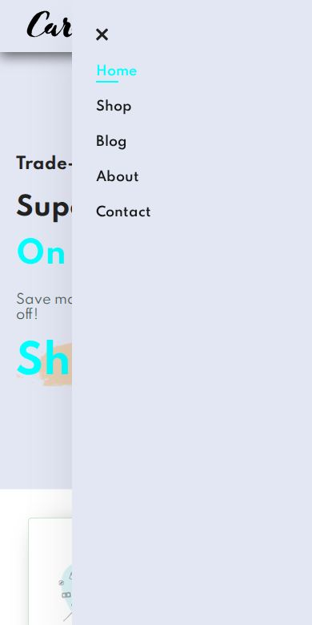

# E-Commerce Store (Front-End)

A responsive, multi-page storefront for a fictional clothing brand ("Cara"), built with plain HTML, CSS and a small amount of vanilla JavaScript. It is a static front-end template: there is no backend, database, real cart or checkout.

The layout follows the **Tech2 etc** YouTube tutorial for an HTML/CSS e-commerce template. Thanks to Tech2 etc for the original walkthrough.



## Features

- Seven pages sharing one header, newsletter strip and footer: Home, Shop, Product Details, Blog, About, Contact and Cart.
- Responsive layout with breakpoints at 799px and 477px (see `style.css`). On small screens the navigation collapses into a slide-in menu opened by the hamburger icon (`script.js`).
- Product grid with brand, name, star rating and price for each product.
- Product details page with an image gallery: clicking a thumbnail swaps the main image.
- Shop page: the first product card links to the product details page.
- Contact page with an embedded Google Map, contact details and a message form.
- About page with an autoplaying, muted product video (`img/about/1.mp4`).
- Cart page showing a sample cart table, coupon box and cart totals.

## What is static

These parts are layout only and have no behaviour behind them:

- **Cart:** the cart table and totals are hard-coded sample rows. "Add To Cart", the cart icons on product cards, the remove buttons, quantity inputs, "Apply" coupon and "Proceed to checkout" do not change anything.
- **Forms:** the newsletter sign-up and the contact form are not connected to any service. Submitting the contact form just reloads the page.
- **Navigation placeholders:** "Shop Now", "Explore More", pagination, "CONTINUE READING", footer account links and social icons link to `#` or do nothing.
- **Content:** names, prices, addresses, phone numbers and blog text are placeholders.

## Tech stack

| Layer | Used |
| --- | --- |
| Markup | HTML5 |
| Styling | CSS3 (Flexbox, media queries), single `style.css` |
| Scripting | Vanilla JavaScript (`script.js` plus a short inline script on `sproduct.html`) |
| Icons | Font Awesome 5.10 Pro CSS, loaded from `pro.fontawesome.com` |
| Font | Spartan, loaded from Google Fonts |
| Map | Google Maps embed iframe |

There are no build tools, package manager or dependencies to install.

## Project structure

```
E-Commerce-store/
├── index.html        # Home: hero, features, featured products, new arrivals, banners
├── shop.html         # Product grid (16 products) and pagination
├── sproduct.html     # Product details with thumbnail gallery
├── blog.html         # Blog post list
├── about.html        # About text, app promo video, features
├── contact.html      # Contact details, Google Map, message form, team contacts
├── cart.html         # Sample cart table, coupon and totals
├── style.css         # All styles and responsive breakpoints
├── script.js         # Mobile navigation open/close
├── img/              # Site images and video (about, banner, blog, features, pay, people, products)
├── Document_files/   # logo.png (copy of img/logo.png, not referenced by the pages)
└── docs/screenshots/ # Screenshots used in this README
```

## Running locally

Clone the repository and open `index.html` in a browser:

```sh
git clone https://github.com/ShibilAhamed701212/E-Commerce-store.git
cd E-Commerce-store
```

Serving the folder over HTTP works the same way and avoids `file://` quirks, for example:

```sh
python3 -m http.server 8000
# then open http://localhost:8000/
```

An internet connection is needed for the icons, the Spartan font and the map. Without it the pages still load but icons (including the mobile menu button) do not render.

## Deployment

Because the site is static, any static host works (GitHub Pages, Netlify, Vercel, an S3 bucket). Publish the repository root; `index.html` is the entry page. No environment variables or build step are required.

## Screenshots

Captured from this repository in headless Chromium.

| Shop | Product details |
| --- | --- |
|  |  |

| Cart | Contact |
| --- | --- |
|  |  |

Mobile navigation (390px wide):



## Fixes in this revision

- **Product gallery did nothing and threw an error.** The inline script on `sproduct.html` looked up the class `sma1l-img` (digit one) while the thumbnails use `small-img`, so it crashed with `Cannot set properties of undefined`. It now uses the right class.
- **Mobile menu did not open on the product details page.** `sproduct.html` never loaded `script.js`; it does now.
- **Contact map showed no location.** The Google Maps embed URL was broken across lines with stray spaces, `|` characters and `0xford`. It is now a valid embed URL pointing at the University of Oxford location the original intended.
- The contact page listed an e-mail address next to the phone icon; it now shows the phone number used in the footer.
- Cart totals ($335) did not match the three $118.19 rows; they now read $354.57.
- Every page was titled "Document"; each page now has its own title.
- The header logo linked to `#`; it now links to the home page.
- E-mail fields in the newsletter and contact form use `type="email"`, so browsers validate the format.

## Known limitations

- Icons come from the Font Awesome **Pro** CDN, which is intended for Pro licence holders. Several icons used (light `fal` icons, `fa-shopping-bag`) are Pro-only, so switching to the free CDN would require choosing replacement icons.
- The about-page video is H.264. It plays in Chrome, Edge, Firefox and Safari, but not in open-source Chromium builds without proprietary codecs.
- `index.html` uses the id `product1` on two sections (the CSS targets that id), and `contact.html` places `<li>` elements directly inside a `<div>`. Browsers render both fine but they are not valid HTML.
- The cart page reuses the contact page's banner text ("#let's_talk").
- Only the first product card on the shop page links to the product details page, and the details page always shows the same product.
- There are no automated tests or CI in this repository.

## Acknowledgments

Based on the Tech2 etc HTML/CSS e-commerce template tutorial on YouTube.
